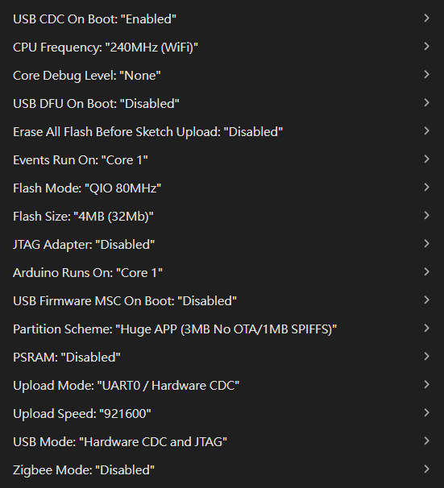

# 雷射槍打靶人機互動模擬
## ESP32燒錄:
    1. 安裝driver: https://www.silabs.com/software-and-tools/usb-to-uart-bridge-vcp-drivers?tab=downloads
    2. 電腦連接上ESP32
    3. 用arduino IDE開啟程式，然後Tools > Board > Board Manager > 搜尋ESP32點擊安裝
    4. 選擇開發板，Tools > Board > esp32 > ESP32S3 Dev Module
    5. 選擇連接埠，開啟裝置管理員看剛剛裝好的driver接在第幾個COM
    6. 確定Tools設定如下圖後就可以按下燒錄



## 用法:
### 有線:
    
燒錄好有線版本後，一樣查看裝置管理員ESP32連接在哪個COM，修改 ```ESP32_wiredConnectYOLO.py``` 的第370行後安裝好必要套件和確認好 ```.pt``` 模型文件路徑無誤後即可執行

### 無線:

燒錄好無線版本後，電腦連接上ESP32_S3的wifi網路(密碼: 大密碼)，確認 ```.pt``` 模型文件路徑無誤後即可執行


## YOLO Package Link
https://drive.google.com/file/d/18i-Xx96OhUK7-rB30_YRHIlrTzHsdz9k/view?usp=sharing

## Unity Package Link
https://drive.google.com/file/d/1F_lKNulnvgApcZwZmCHVYnmHiyA-DkZb/view?usp=sharing
